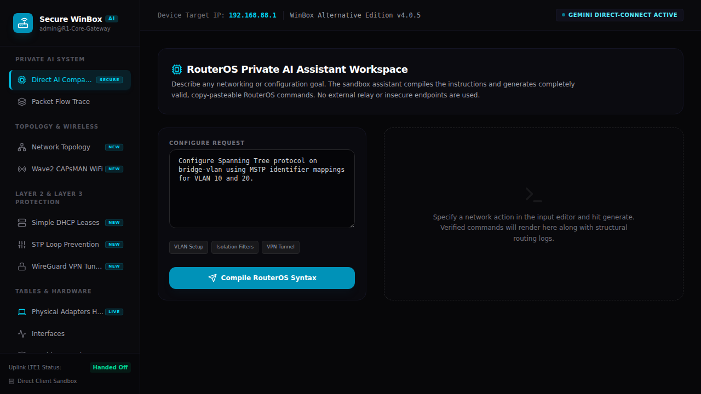
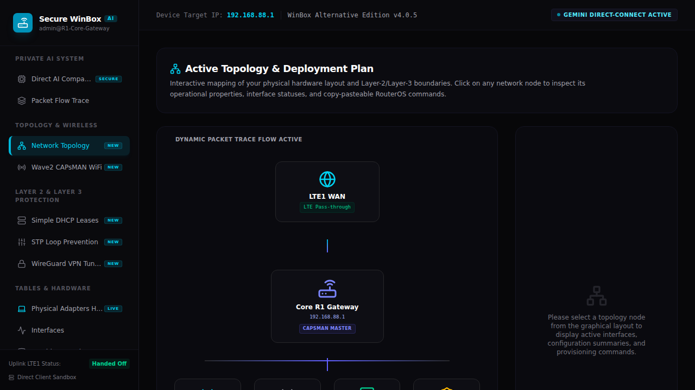
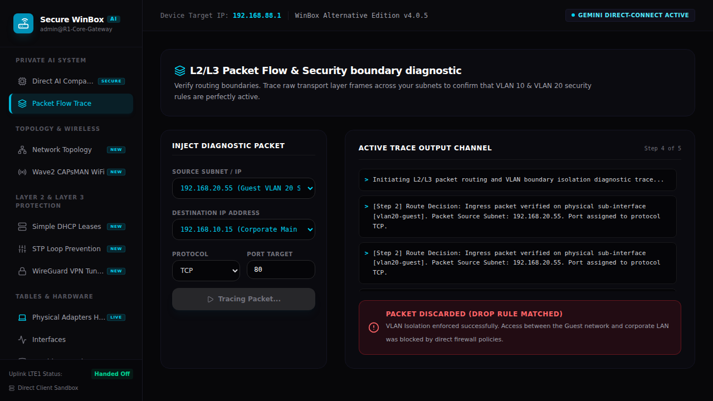
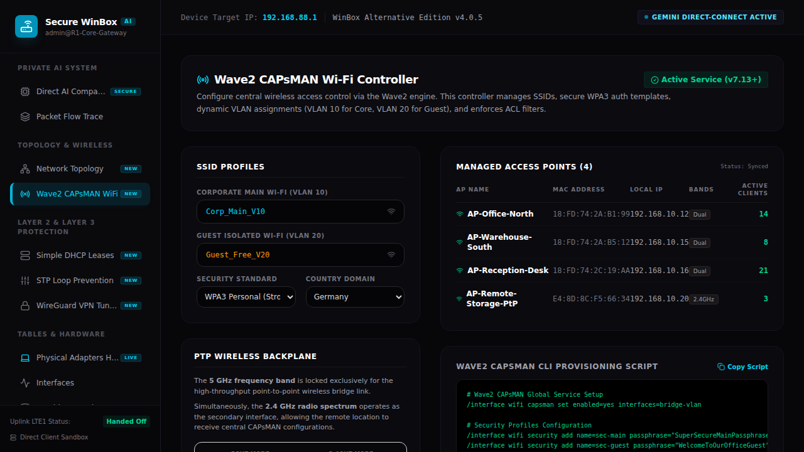
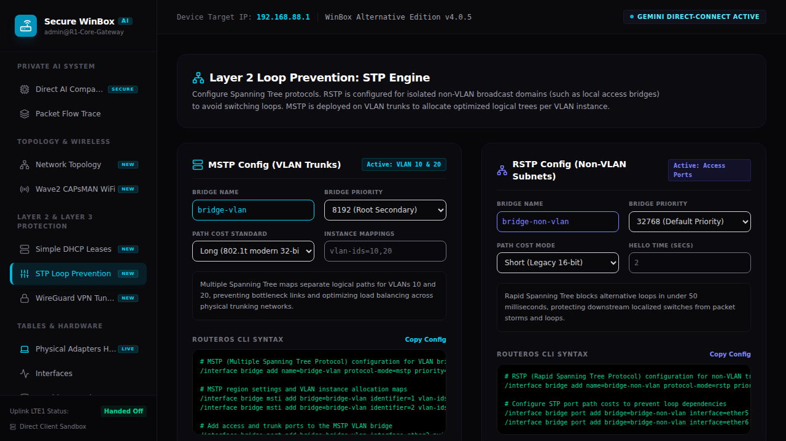
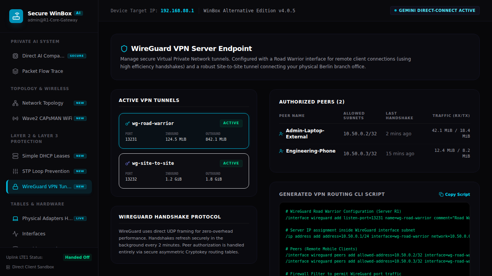
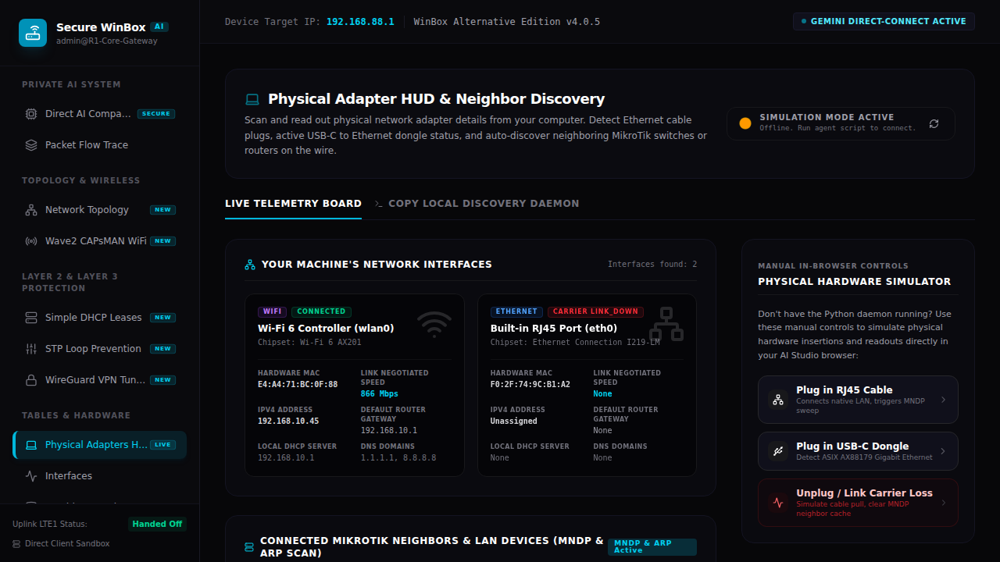

<div align="center">

</div>

# Secure WinBox AI

Secure WinBox AI is a state-of-the-art administrative and diagnostic panel for MikroTik RouterOS powered by standard, secure LLM endpoints. It provides administrators with a highly visual, standalone simulator to construct, compile, and visualize advanced routing and isolation configurations securely without leaking private configurations.

View your app in AI Studio: https://ai.studio/apps/906a3c74-2218-4bae-bf8d-00beeb368735

---

## 🚀 Key Features & GUI Guided Tour

Below is a walkthrough of the specialized administrative and routing tools embedded inside Secure WinBox AI, accompanied by screenshots of the live system in action.

### 1. Direct AI Companion Workspace
The main assistant workspace allows administrators to type natural language network requirements. The engine then compiles copy-pasteable, valid RouterOS configuration scripts. Commands can also be directly simulated onto virtual UI tables on the fly.



---

### 2. Live Network Topology Visualization
A visual representation of the device layout, tracking virtual bridge ports, physical ethernet ports, local LTE gateways, and downstream APs. Displays port statuses dynamically to prevent visual mistakes.



---

### 3. Packet Flow Trace & Diagnostic Isolation
Inject and trace test packets between subnets to verify that guest and corporate VLANs are isolated. Step-by-step firewall matching logic runs locally to display decisions (e.g. drop or forward) and show which specific firewall filters were matched.



---

### 4. Wave2 CAPsMAN Wireless Controller
A dedicated controller panel to deploy modern, hardware-accelerated CAPsMAN configurations, manage access point channels, broadcast custom SSID configurations, and authorize wireless clients.



---

### 5. STP/MSTP Loop Prevention Configurator
A smart Layer-2 configuration module designed to configure Spanning Tree Protocol parameters (such as path costs and bridge priorities) to avoid loops in high-availability environments.



---

### 6. WireGuard VPN Tunnels Manager
A modern hub for managing secure VPN tunnels. Allows peer registrations, public/private key exchanges, setting endpoint listeners, and assigning allowed IP bounds.



---

### 7. Physical Local Adapters HUD
A real-time HUD interface tracking local adapter statistics, Rx/Tx speeds, packets, errors, and system loads, ensuring visual feedback of active hardware statuses.



---

## Run Locally

**Prerequisites:** Node.js

1. Install dependencies:
   ```bash
   npm install
   ```
2. Set the `GEMINI_API_KEY` in `.env.local` to your Gemini API key (or use the localized Ollama integration option inside the system).
3. Run the app:
   ```bash
   npm run dev
   ```
4. Open the browser at: [http://localhost:3000](http://localhost:3000)
